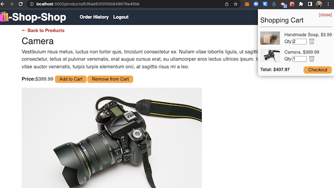
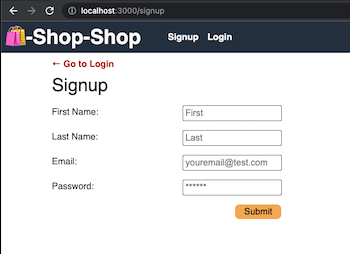

 
 

# E-Commerce Redux Conversion (from Context)

## Description

A fully functioning E-Commerce site that uses GraphQL to interface to a MongoDB Server. . Client front end uses React, InnoDB and Redux to manage state and uses apollo client GraphQL interface to access services.  This project converted an existing code base where the state management was using Context and converted it to a Redux state management.

## Table of Contents

- [Demo and Screen Shots](#demo)
- [Installation](#installation)
- [Usage](#usage)
- [Credits](#credits)
- [License](#license)
- [Questions](#questions)

## Demo
***

Demo:

Screen Shot:

## Installation
***

clone repo, npm run install, npm run seed (with a running MongoDB instance).

## Usage
***

npm run develop or npm run start and access on localhost:3000 for develop and :3001 for production.

## Credits
 ***

[conradjohnson](https://github.com/conradjohnson)

 ## License
 ***

  ISC License

  [https://opensource.org/licenses/ISC](https://opensource.org/licenses/ISC)
  
  Permission to use, copy, modify, and/or distribute this software for any
  purpose with or without fee is hereby granted, provided that the above
  copyright notice and this permission notice appear in all copies.
  
  THE SOFTWARE IS PROVIDED "AS IS" AND THE AUTHOR DISCLAIMS ALL WARRANTIES WITH
  REGARD TO THIS SOFTWARE INCLUDING ALL IMPLIED WARRANTIES OF MERCHANTABILITY
  AND FITNESS. IN NO EVENT SHALL THE AUTHOR BE LIABLE FOR ANY SPECIAL, DIRECT,
  INDIRECT, OR CONSEQUENTIAL DAMAGES OR ANY DAMAGES WHATSOEVER RESULTING FROM
  LOSS OF USE, DATA OR PROFITS, WHETHER IN AN ACTION OF CONTRACT, NEGLIGENCE OR
  OTHER TORTIOUS ACTION, ARISING OUT OF OR IN CONNECTION WITH THE USE OR
  PERFORMANCE OF THIS SOFTWARE.
  
  Copyright (c) 2022 James Johnson
          

# Questions
***
For questions or assistance, please contact through [GitHub Account](https://github.com/conradjohnson) or email: [notmyemail@gmail.com](mailto:notmyemail@gmail.com)

 [Back to top](#description)